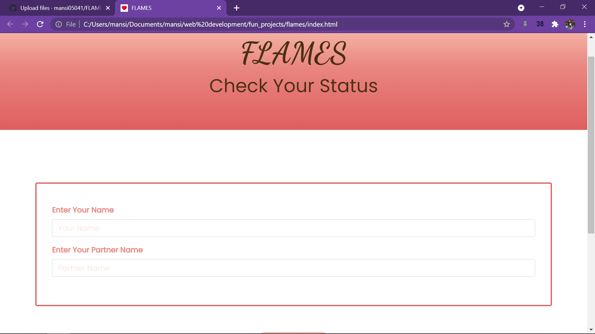

# FLAMES
This is a fun project based on FLAMES algorithm !!! 

## Table of contents

- [Overview](#overview)
- [Screenshot](#screenshot)
- [Links](#links)
- [My process](#my-process)
- [Built with](#built-with)
- [What I learned](#what-i-learned)
- [Continued development](#continued-development)
- [Useful resources](#useful-resources)
- [Author](#author)

## Overview
FLAMES : It's game popular among teenagers to know about the relationship status.
There are two steps in this game:

Take the two names.
- Remove the common characters with their respective common occurrences.
- Get the count of the characters that are left .
- Take FLAMES letters as [“F”, “L”, “A”, “M”, “E”, “S”]
- Start removing letter using the count we got.
- The letter which last the process is the result.


### Screenshot



### Links

- Solution URL: [https://github.com/mansi05041/FLAMES]
- Live Site URL: [https://mansi05041.github.io/FLAMES/]

## My process

To make website i used Bootstrap for form input & apply the game algorithm to f=get result.

### Built with

- Semantic HTML5 markup
- CSS custom properties
- Javascript
- Mobile-first workflow
- Bootstrap

### What I learned

```js
 else{
    //algorithm of game
    var arr = ["F","L","A","M","E","S"];
    const name1 = document.querySelector(".name1").value.split("");
    const name2 = document.querySelector(".name2").value.split("");
    //deleting common words
    for (var i = 0; i<name1.length; i++){
      for (var j = 0; j<name2.length; j++){
        if (name1[i]===name2[j]){
        name1.splice(i,1);
        name2.splice(j,1);
        }
      }
    }
    //removing extra spaces
    if (name1.includes(" ")===true){
      name1.splice(name1.indexOf(" "),1);
    }
    if (name2.includes(" ")===true){
      name2.splice(name2.indexOf(" "),1);
    }
    var total = name1.length + name2.length;
    var counter = 0;
    //getting status
    while(arr.length!==1){
      if (arr.length<total){
        var rem = total%arr.length;
        arr.splice(rem-1,1);
        counter=rem-1;
      }
      else if(arr.length===total){
        arr.pop();
        counter=0;
      }
      else{
        arr.splice(total-1,1);
        counter=total-1;
      }
      if (counter<0){
        counter=0;
      }
      if (counter!==0){
        const arr1 = arr.slice(0,counter);
        const arr2 = arr.slice(counter,arr.length);
        arr = arr2.concat(arr1);
      }
    }
```

### Continued development

Improvement in Responsive Area

### Useful resources

- [w3schools](https://www.w3schools.com/css/css_rwd_mediaqueries.asp) - This helped me for understanding the media querry.
- [MDN](https://developer.mozilla.org/en-US/) - This is helpful in implementation of javascript.
- [Bootstrap](https://getbootstrap.com/) - This helped in form input.

## Author

- Frontend Mentor - [@mansi05041](https://www.frontendmentor.io/profile/mansi05041)
- Linkedin - [mansi joshi](https://www.linkedin.com/in/mansi-joshi-663aa81a0/)
